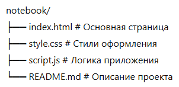

# 🗒️ Notebook — JavaScript Learning Project

Простое приложение для заметок, созданное для практики JavaScript, работы с DOM и LocalStorage.

Демонстрация - https://nataliyayadykina.github.io/notesJS/

## 🚀 Функционал

- Добавление, редактирование и удаление заметок
- Хранение данных в `localStorage`
- Адаптивный дизайн под разные устройства
- Минималистичный и аккуратный интерфейс

## 📁 Структура проекта

## 🧠 Технологии

- HTML5
- CSS3 (Flexbox, адаптивная вёрстка)
- Vanilla JavaScript (без фреймворков)
- LocalStorage API

## 💡 Как запустить

1. Склонируйте репозиторий:

   `git clone https://github.com/NataliyaYadykina/notesJS.git`

2. Откройте файл `index.html` в браузере.

> Все заметки сохраняются в браузере и не теряются при перезагрузке страницы.
